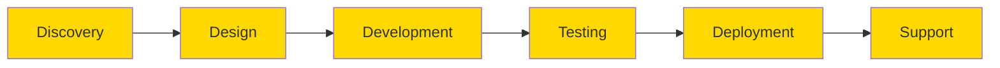

# 🐝 CODEHIVE

  
  
  **Transforming ideas into stunning, functional digital experiences**
  
  
  

---

## 🌟 Why CodeHive Stands Out

At CodeHive, we combine **cutting-edge design trends** with **robust, secure code**. Every project is mobile-first, performance-optimized, and crafted with your users in mind. We don't just build websites — we create experiences that convert visitors into loyal customers.

## 🚀 What We Excel At

| 📱 **Responsive & Mobile-First Design** | 💻 **Front-End & Back-End Development** |
|:---:|:---:|
| Pixel-perfect designs that work flawlessly across all devices | Modern frameworks and robust server architectures |

| 🔒 **Security & Performance Optimized** | 🎨 **UX/UI Design Expertise** |
|:---:|:---:|
| Enterprise-grade security with lightning-fast load times | Intuitive interfaces that users love |

| 🛠️ **Custom Web Applications** | 🔌 **API Integrations & Automation** |
|:---:|:---:|
| Tailored solutions for unique business needs | Seamless third-party integrations and workflow automation |

## 🛠️ Our Tech Stack

**Frontend**

**Backend**

**Cloud & DevOps**

## 🏆 Featured Projects

### 🎯 CodeHive Dashboard
A comprehensive management platform for websites and analytics with secure encrypted logins, database-integrated tracking, and multi-website support.

**Features:**
- 🔐 Secure encrypted authentication
- 📊 Advanced analytics tracking
- 🌍 Multi-website management
- 🔔 Real-time notifications
- 📱 Mobile-responsive design

[**View Dashboard →**](https://app.codehive.vip)

### 🚀 Recent Client Projects
- **E-commerce Platform** - Custom React/Node.js solution with payment integration
- **SaaS Application** - Full-stack web app with subscription management
- **Mobile App** - React Native cross-platform application
- **API Development** - RESTful APIs with comprehensive documentation

## 📈 Our Process

## 💼 Ready to Take Your Project to the Next Level?

Let CodeHive transform your ideas into a stunning, functional website or application. Whether you need a sleek front-end, a robust back-end, or full-stack development, we bring your vision to life.

**Explore our skills and see what we can build together!**

### 🤝 Get In Touch

---

  Built with 💛 by the CodeHive team

